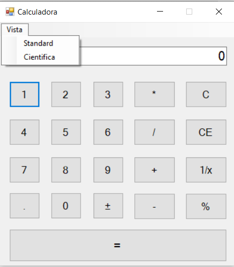

# Calculadora en Visual Basic

Realización de una calculadora por pasos, cada commit es una peticion del ejercicio

## Calculadora Standard

## Calculadora Cientifica

### Mostrar error en el display

## Version 4

Añadir un menu para vista de calculadora cientifica con las operaciones x^2, x^3, x^y, n!

### corregido

1) Union del metodo click de los botones numeros
2) Union del metodo click de los botones de accion directa sobre el display
3) Union del metodo click de los botones de operaciones de dos operandos

## Version 4.0.1

1) Añadido boton eliminar último caracter haciendo la funcion que hacia CE
2) Boton CE borra el display pero mantiene el primer operando y/o operacion si los hubiera
3) Boton C Manda todos los parametros a sus valores por defecto

## Version 4.0.2

1) Añadido opcion ayuda en menu
2) Ventana ayuda calculo del %
3) Correcion del calculo del %

## Version 5.0.1

1) Modificacion del diseño
 
2) Añadido opciones ayuda
 
3) Añadido operaciones inversas de seno, coseno, tangente en grados
4) Añadido en Display "vea ayuda" cuando se opera mal con el %
5) Controlado cuando el Display sobrepasa los digitos en numeros con Exponente
6) Controlado cuando en el Display se introducen letras
7) Documentados los principales metodos